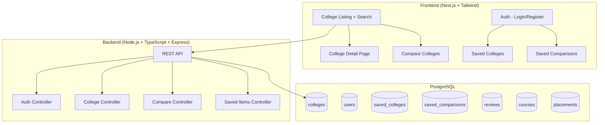

# College Discovery Platform — Implementation Plan

## Architecture

## Phase 1: Backend Setup
1. Initialize Node.js + TypeScript project
2. Setup PostgreSQL schema (colleges, users, reviews, courses, placements, saved_colleges, saved_comparisons)
3. Seed database with 50+ AI-generated colleges
4. Build REST APIs:
   - `GET /api/colleges` (list, search, filter, paginate)
   - `GET /api/colleges/:id` (detail with courses, placements, reviews)
   - `POST /api/auth/register` + `POST /api/auth/login`
   - `POST /api/saved/colleges` + `GET /api/saved/colleges`
   - `POST /api/saved/comparisons` + `GET /api/saved/comparisons`
   - `POST /api/compare` (compare 2-3 colleges)

## Phase 2: Frontend Setup
1. Initialize Next.js with Tailwind CSS
2. Build pages:
   - `/` — Landing + College listing with search/filter
   - `/college/[id]` — College detail
   - `/compare` — Compare colleges
   - `/login` + `/register` — Auth pages
   - `/saved` — Saved colleges + comparisons

## Phase 3: Polish
1. Responsive design
2. Animations + transitions
3. Error handling
4. Loading states

## Database Schema

| Table | Columns |
|-------|---------|
| colleges | id, name, location, city, state, type, established, rating, fees_min, fees_max, description, image_url, placement_rate, avg_package, highest_package |
| courses | id, college_id, name, duration, fees, degree_type |
| placements | id, college_id, year, placement_rate, avg_package, highest_package, top_recruiters |
| reviews | id, college_id, author, rating, comment, date |
| users | id, email, password_hash, name, created_at |
| saved_colleges | id, user_id, college_id |
| saved_comparisons | id, user_id, college_ids[], name, created_at |
